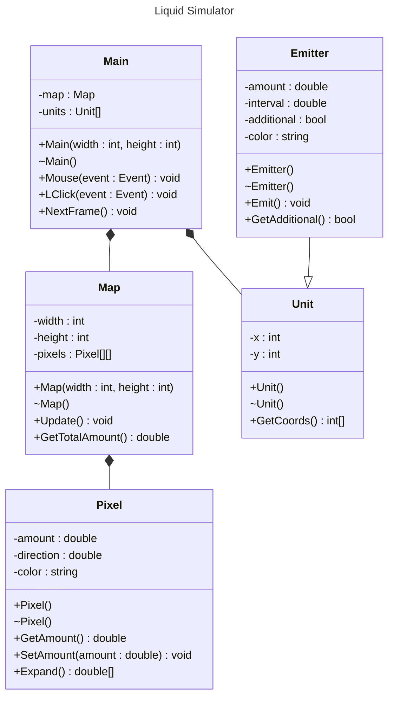

# Liquid Simulator

```mermaid
---
title: Liquid Simulator
---
classDiagram
    class Main{
        -map : Map
        -units : Unit[]

        +Main(width : int, height : int)
        ~Main()
        +Mouse(event : Event) void
        +LClick(event : Event) void
        +NextFrame() void
    }

    class Map{
        -width : int
        -height : int
        -pixels : Pixel[][]
        
        +Map(width : int, height : int)
        ~Map()
        +Update() void
        +GetTotalAmount() double
    }

    class Pixel{
        -amount : double
        -direction : double
        -color : string

        +Pixel()
        ~Pixel()
        +GetAmount() double
        +SetAmount(amount : double) void
        +Expand() double[]
    }

    class Unit{
        -x : int
        -y : int

        +Unit()
        ~Unit()
        +GetCoords() int[]
    }

    class Emitter{
        -amount : double
        -interval : double
        -additional : bool
        -color : string

        +Emitter()
        ~Emitter()
        +Emit() void
        +GetAdditional() bool
    }

    Main *-- Map
    Main *-- Unit
    Map *-- Pixel
    Emitter --|> Unit

```
