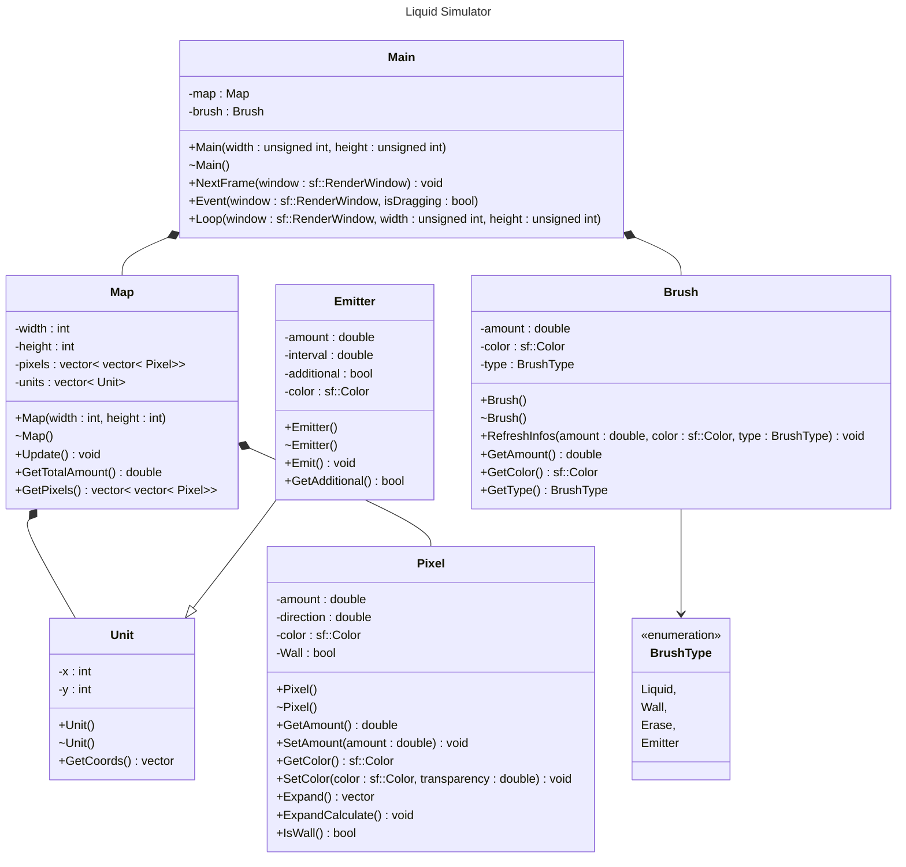

# Liquid Simulator

## TODO List :
- [x] Init project
- [x] Code pixel
- [x] Can draw on window
- [x] Display map
- [x] Binding mouse
- [x] Animation
- [x] Expansion calculations
- [ ] Brush & Global Panels
- [ ] Multiple liquids management
- [ ] Creating Units
- [ ] Save/Load